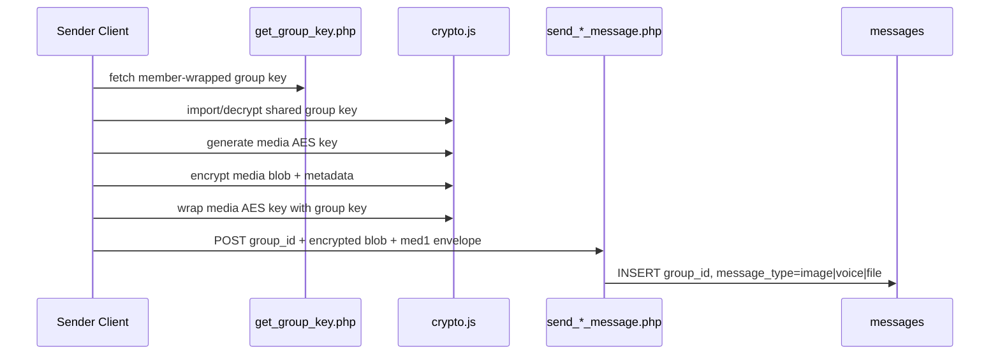
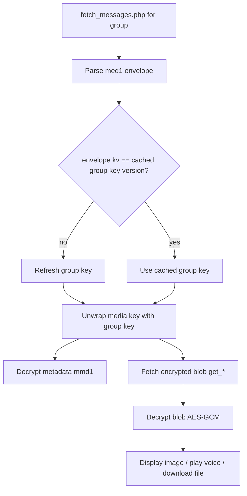

# Group Media Messages (Image/Voice/File): Encryption/Decryption

## Summary

Group media uses per-message AES key for payload, then wraps that media key using the group shared key.

- Blob at rest: encrypted bytes (`.bin`)
- Envelope (`med1`) in DB includes:
  - `k`: group-wrapped media key
  - `m`: encrypted metadata
  - `kv`: group key version marker

## Send Pipeline

## Receive Pipeline

## Security Guarantees

- Non-members cannot decrypt media even if blob is leaked.
- Server-side code enforces membership before serving encrypted blob.
- `kv` supports rotation-aware client behavior.
