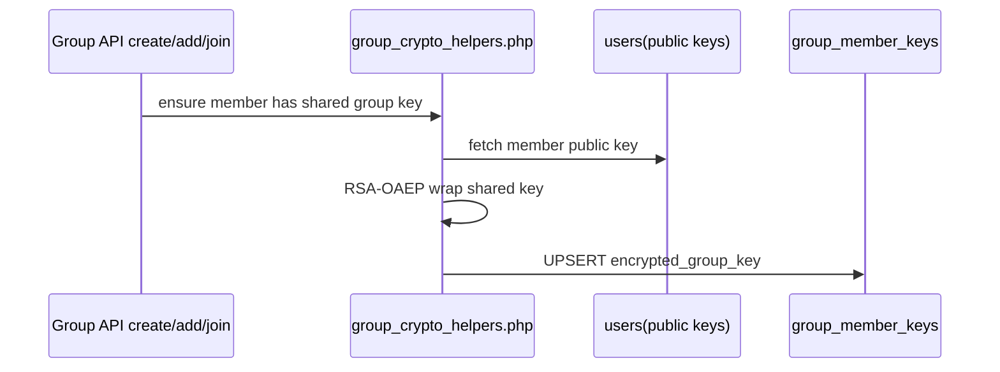
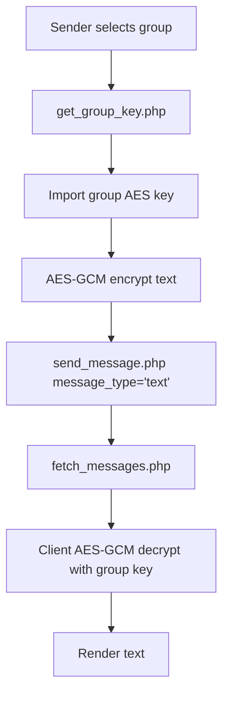

# Group Text Messages: Encryption/Decryption

## Summary

Group text uses one shared AES-GCM key per group.

- Encrypted payload format: `gcm1:<iv_b64>:<cipher_b64>`
- Stored in both `message` and `message_for_sender` for group rows.

## Group Key Distribution

## Encrypt/Decrypt Runtime

## Notes

- Membership is enforced on all group read/write operations.
- Client refreshes key cache when needed; failures surface as send/decrypt errors.
