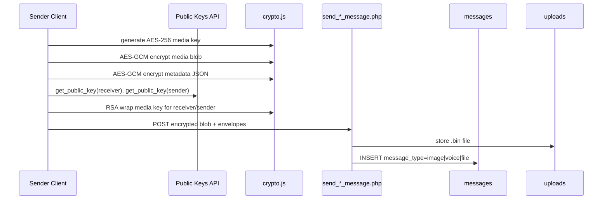
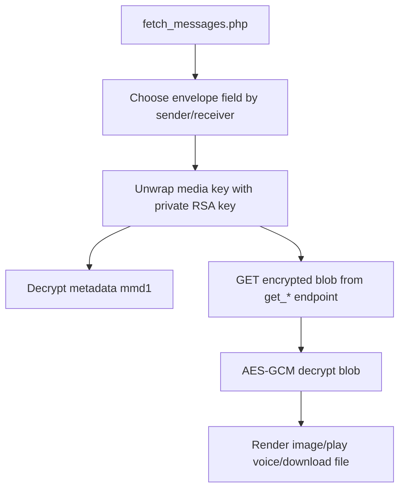

# Private Media Messages (Image/Voice/File): Encryption/Decryption

## Summary

Private media is encrypted with a fresh per-message AES key, then that key is wrapped separately for recipient and sender.

- Blob at rest: encrypted bytes (`uploads/*/*.bin`)
- Envelope in DB (`message` / `message_for_sender`):
  - `v='med1'`
  - `k` wrapped media key
  - `m` encrypted metadata (`mmd1`)
  - `kv=1`

## Send Pipeline

## Receive Pipeline

## Notes

- Server cannot decrypt payload; it stores/transports ciphertext.
- File name and MIME are taken from decrypted metadata on client.
