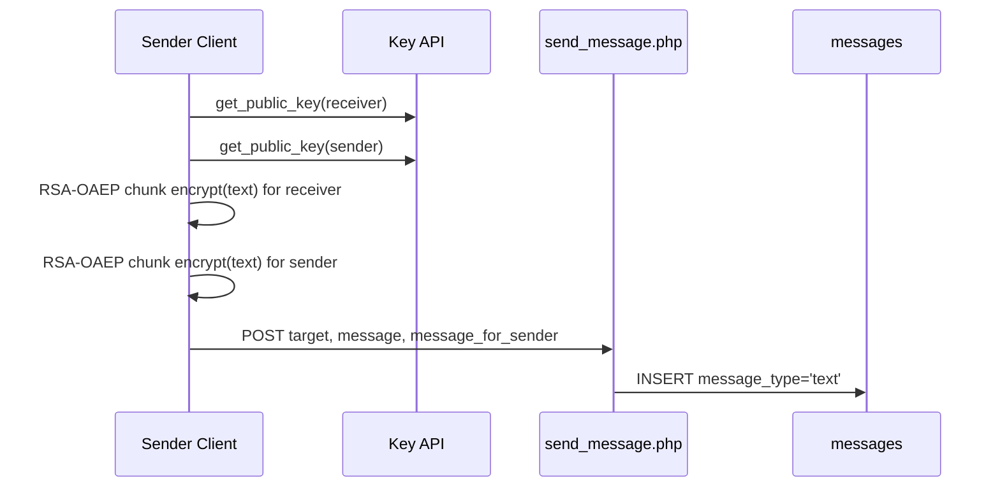
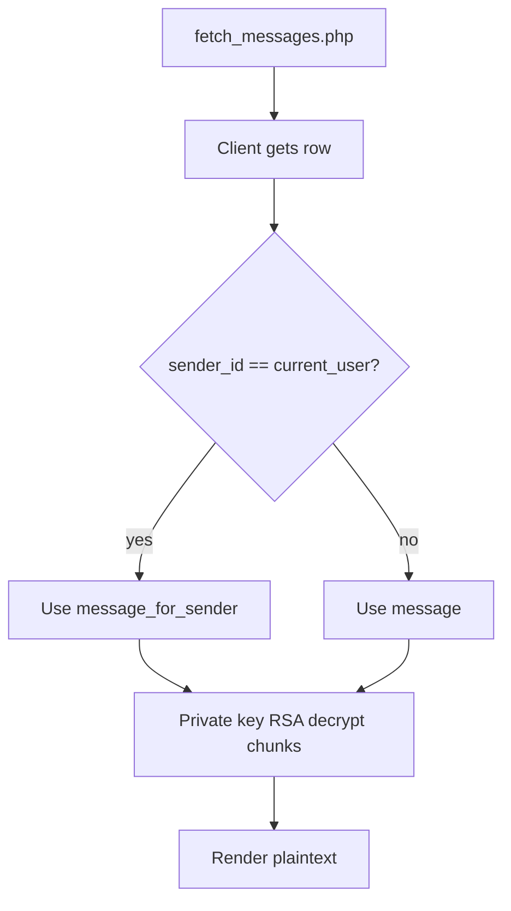

# Private Text Messages: Encryption/Decryption

## Summary

Private text is encrypted per recipient and separately for sender copy.

- Recipient payload -> `messages.message`
- Sender payload -> `messages.message_for_sender`

## Encrypt Flow

## Decrypt Flow

## Notes

- Chunking is UTF-8 byte-aware to avoid multibyte breakage.
- Direct RSA key import uses OAEP SHA-256 path for text.
